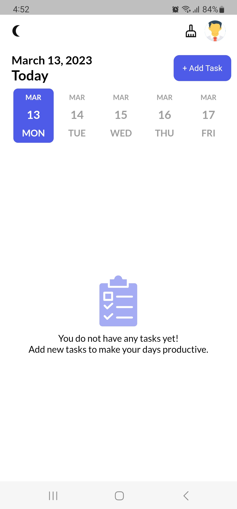
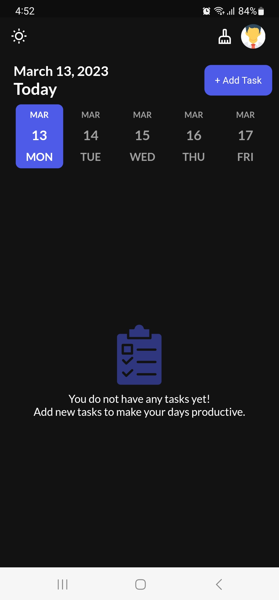
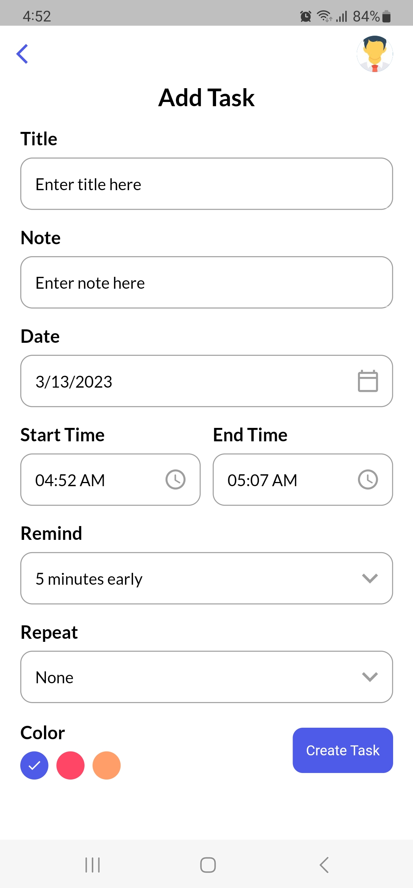
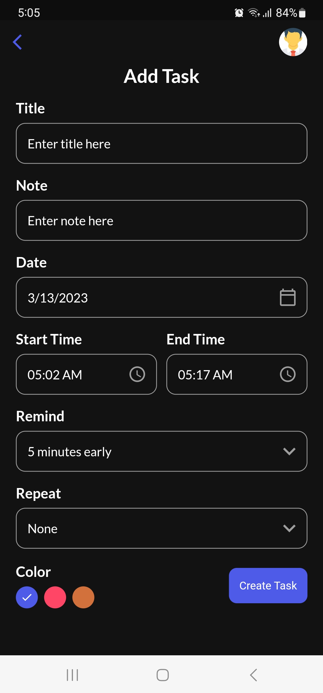
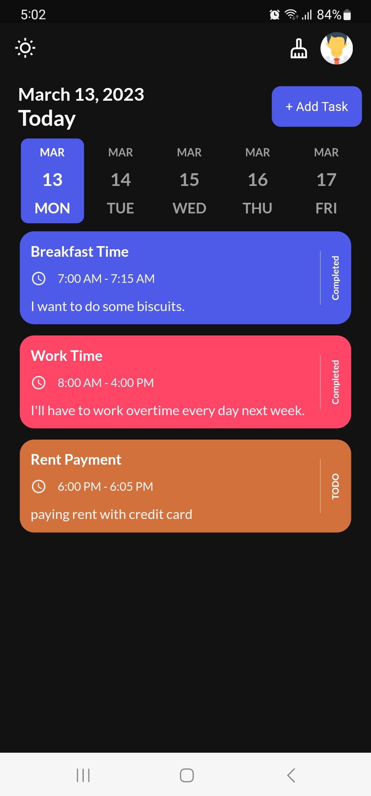

# ✅💪 Advanced_TODO_App

a TODO App, created with dart and flutter framework with GETX statemanagement and SQLite database.

## Getting Started

TODO helps users manage their tasks and activities (It's an advanced version).

Star ⭐ the repo to support the project.

## Features

- Creating and managing lists of tasks.

- Setting due dates and reminders.

- Categorizing tasks and tracking progress.

- Support Theme mode (Light mode - Dark mode).

- Deleting tasks.

## Screenshots

  
   

  
   

  
   

## Questions?🤔

Hit me on

## Contributing

Pull requests are welcome.
